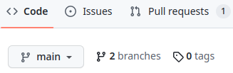
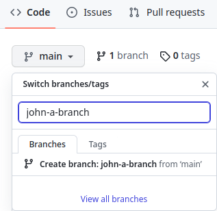
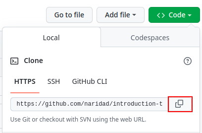
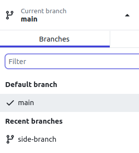
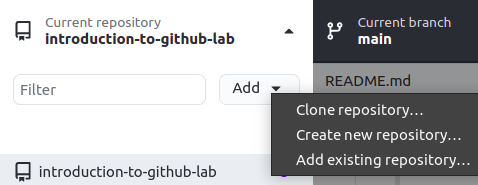
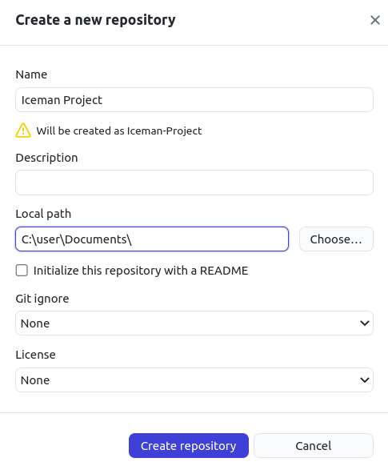
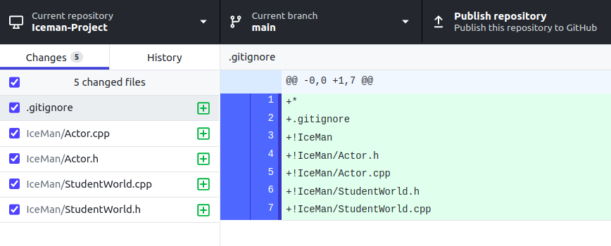
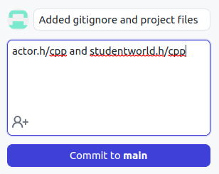

# Introduction to Git and Github

## Introduction

Git is a distributed version control system. A distributed version control system is a piece of software that helps you organize your projects whether you work alone or collaborate with others. It has become integral to the world of STEM as it helped replace the olden days of sending code back and forth through emails. It generates a history of every change you've made and keeps those changes so collaborators can see exactly what others have worked on and make contributions to others' work.

The difference between Git and Github is that git is a separate software created back in 2005 by Linus Torvalds, the same person who created the Linux operating system. Github is a cloud computing implementation of Git created in 2008. This is the equivalent of Microsoft Word being created, then Google Drive coming along and allowing you to collaborate and access your documents from multiple devices with ease.

## Why you should learn about Github

If you plan on continuing in Computer Science, you'll run into Github in both your upper division classes and in your career. Even if you don't plan on continuing with CS, many STEM fields still need the use of code to process their data, and that code will often be shared and maintained using Github.

## Setup

First, install the following software on your own device.

[Github Desktop](https://desktop.github.com/)


Use whatever code editor you prefer, but here is a link to a recommended one if you need it.

[Visual Studio Code (optional)](https://code.visualstudio.com/)

## Definitions

**What is a repository?**

A repository is a project of files and folders that are tracked for changes. This tutorial is a repository itself.

**What is a branch**

A parallel working version of your repository. You can have multiple branches at a time and branches can be created and deleted at will. Each repository's default branch is called `main`.

<details>
<summary><h2> Making a fork </h2></summary>

You'll be working with a lab partner, so the next step only needs to be done by one person.

1. At the top right of the repository webpage, click the button labeled **Fork**. This makes a copy of the entire repository and moves it to your account so you can make whatever changes you want.


2. In the next screen, change the name to `introduction-to-github-first-partner-first-name-last-initial-second-partner-first-name-last-initial`. For example, `introduction-to-github-john-a-kyle-d`.

3. Make the repository private and keep **Copy the main branch only** checked, then click **Create fork**.

4. Wait about 30 seconds for Github to finish forking the repository, then refresh the page. You can continue the lab from this repository.

5. In this new repository, select the Settings tab near the top right, then click Collaborators on the left. Add your professor, **srussell@elcamino.edu**, and your lab partner.

</details>

<details>
<summary><h2> Making a branch </h2></summary>

Making a new branch allows you to make changes to the repository without affecting other aspects of the project. That means people can upload different changes to a project without conflicting with other's work.

Each lab partner will have to do this next section on their own

1. At the top left of the page, click the button that says **main**



2. Enter the name for the branch following the following naming convention, `first-name-last-initial-branch`. For example, `john-a-branch`. Then click **Create branch:**.



</details>

<details>
<summary><h2> Commit a file </h2></summary>

A commit is a group of edits you've made to files and folders. 

1. Open up Github Desktop. At the top right of the screen, click **File** -> **Options**. Login to your Github account from this screen.

2. Go back to the repository in your web browser. Click the green button near the top of the repository that says **Code**. Click the button next to the link to copy the link.



3. In Github Desktop, click **Clone a repository from the internet**. You should see the repository you forked in the previous step. Select that repository and click **clone**.

4. At the top, open the drop down menu titled **main branch** and select the branch you created earlier in this lab. 

5. Use whatever text editor to open up the folder that's been downloaded. If you already have Visual Studio Code installed, you can click **Open in Visual Studio Code**.

6. Create a new file named `hello-world-first-name-last-initial.c` ie `hello-world-john-a.c` with the following code:
```
#include <iostream>

int main() {
    std::cout << "Hello World!";
    return 0;
}
```
7. In Github desktop, you'll see your new file pop up on the left with the lines you added in the middle. At the bottom right, fill in the top text box to say **Added hello world**. Click the green button labeled **Commit** in the bottom left.

8. At the top of the screen, click **Fetch Origin**, then after a second, **Push Origin**. After that you can view the repository in your web browser and you should see your new file inside the branch you created. 

**Push and Pull**

Imagine you are pushing your 'block' of code to the repository. That is the same as uploading your changes. The same concept works the other way. When someone has made changes to the repository that you have not yet seen, you download, or **pull** those changes.
</details>

<details>
<summary><h2> Open a pull request </h2></summary>

Pull requests, or PRs, are used to combine branches either from the same repository or a different one. Instead of heading straight to making a commit, a pull request can be used to propose a change. Someone else can then look over your proposal before approving it and adding your change to the target branch.

In this lab, both you and your partner will make a pull request, merging their own branch to the main branch. 

1. After you've made your commit, you'll notice a message notifying that you can compare and make a pull request. You can either click that message, or access the pull request tab at the top of the repository page. If you choose the message, you can skip to step 5.

2. From the Pull requests tab, click **New pull request**. Make sure the main branch is selected from the **base:** dropdown menu.

3. In the **compare:** dropdown, select the branch you made previously.

4. Click **Create pull request**.

5. Provide a title and description. You can include info about the new branch and file that you created.

6. Click **Create pull request**.

**Background to a pull request**

The conceptual understanding of a pull request is that you propose a change and request that someone else pulls your changes into the repository. A pull request is often used when working on projects you do not have direct permissions to edit. You can contribute to other people's projects using a pull request.
</details>

<details>
<summary><h2> Edit your partner's branch</h2></summary>

Here is where the collaboration that Github features comes in.

1. Back in Github Desktop, you'll still currently be in your own branch. Click the branch dropdown menu and select your partner's branch.



2. Open up your partner's file that they made and edit to contain the following:
```
using namespace std;
#include <iostream>

int main() {
    cout << "Hello World!";
    return 0;
}
```
3. Following the steps from how to commit a file, save your changes and push this change to your partner's branch

</details>


<details>
<summary><h2> Merge your pull request </h2></summary>

Now that both of you have created a pull request, you can both view each other's new branch and file. Merging a pull request is the act of combining two different branches into one, the two branches you proposed in your pull request.

1. Navigate to the **Pull request** tab and find your pull request.

2. Click **Merge pull request**, then **Confirm merge**.

3. After your branch has been merged, all the changes from that branch will now appear on the main branch. You don't need that branch anymore and you can now delete it


And that's it! To turn in this lab, **submit** the link to your repository through **Canvas** and make sure the professor's email has been added as a collaborator.

Since you'll be using Github for your final project, you can always look back to this lab to refresh yourself on how some steps work.

The last section will show you how to use what you learned with your final project

</details>

<details>
<summary><h2> Github and your Final Project </h2></summary>
Since your final project will be done with a partner, Github is a perfect tool to use to collaborate. Refer back here when starting your project.

<h2> .gitignore </h2>
Only one group member needs to do the next section. The other group member will clone the repository later.

.gitignore is a file that can be used to ignore certain files inside a repository folder. This means you can have notes and other personal files inside the same folder as the repository folder without sharing them with others.

This is especially useful for programmers and object files. Since you'll be compiling your project everytime you make a change, you'll be creating new object files that your partner doesn't actually need. 

After you extracted your IceMan project, go inside the IceMan folder that contains all of the header and cpp files. From here, make a file called `.gitignore`. The period at the front of the file name is important. Inside, put this text.

```
*
.gitignore
!IceMan
!IceMan/Actor.h
!IceMan/Actor.cpp
!IceMan/StudentWorld.h
!IceMan/StudentWorld.cpp
```

Each line here is a file or folder that git will ignore when scanning your folder for any changes. This means that the only files you'll need to turn in will appear in the repository.

Since the project has so many files, it is easier to specify what git shouldn't ignore. The `*` tells git to ignore everything. Then the `!` in front of each file name tells git that it shouldn't ignore that file.

<h2> Creating your repository </h2>
Since the project files were given to you through a zip folder, you'll have to create your own repository. 

Back in Github Desktop, click the button at the top left labeled **Current repository**. Next, click **Add**, then **Create New Repository**



From this menu, fill in the Name with **IceMan-Project**. Choose the folder you put the project in, then click **Create repository**



This will create a new folder named IceMan-Project inside the folder specified. In the example, this will be inside the Documents folder. From here, move the .gitignore file, IceMan folder (containing cpp and h files) and the IceMan.sln file into this **IceMan-Project** folder.

In Github desktop, you should see these new files added. 



Next, click **Publish repository**, then the button also titled **public repository**. Now you'll be able to see this repository attached to your account on Github.

On the bottom left of Github Desktop, fill in the 



Then click **Commit to main**. At the top, click **Push origin**. If you see **Fetch origin**, click that, then it will say **Push origin**. After that, you'll see your work has been uploaded to Github.

Now, following the steps used in this lab, your lab partner can clone the repository. Your lab partner will also need to copy over the other files from the IceMan folder. After they have done that, you two can start working. 


</details>